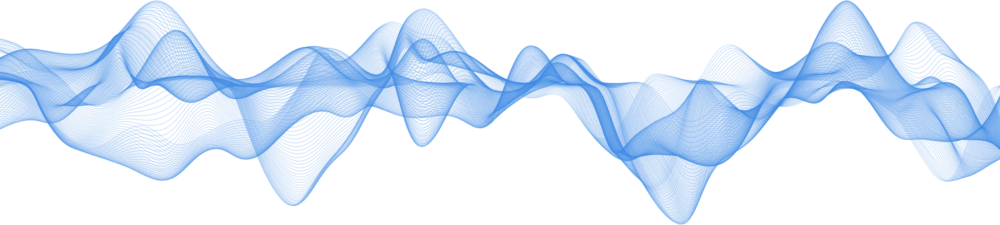

# Blend Line Wave Animation

The goal of this project is to create a web canvas animation that resembles the image below.

The repository also contains a [presentation](presentation.pdf) and a [video recording](recording.mov) of the project.

The animation should:

1. Work in an HTML canvas.
2. Look as though it takes place in a 3D environment.
3. Gently move even without microphone input.
4. Enable microphone input.
5. Animate the curve based on microphone input when enabled.
6. Visibly show the microphone effect on the curve in the 3D space.
7. Use a moderate amount of computational resources.

## Installation and setup instructions

1. Clone the repository.
2. Make sure you have `pnpm` installed. Version 8 or higher should work fine.
   - If using nix, you can run `nix-shell` to enter a shell with `pnpm` installed.
3. Run `pnpm install` to install the dependencies.
4. Run `pnpm dev` to start the development server or `pnpm build && pnpm start` to build and start the production server.
5. Head to `http://localhost:3000` to see the animation.

## Approach

1. Lines are drawn one after another with increasing transparency.
2. For the base animation, we use N points in the XY plane, each oscillating along the Z-axis with random amplitude, frequency, and phase, while also moving with a random vector in the XY plane.
3. When microphone input is enabled, the sound is transformed into the frequency domain using FFT.
4. The sound along the X-axis is added to all points being drawn.
5. The signal for each X-point is smoothed using an Exponential Moving Average (EMA).
6. The history of the sound signal travels along the Y-axis (away from the user).
